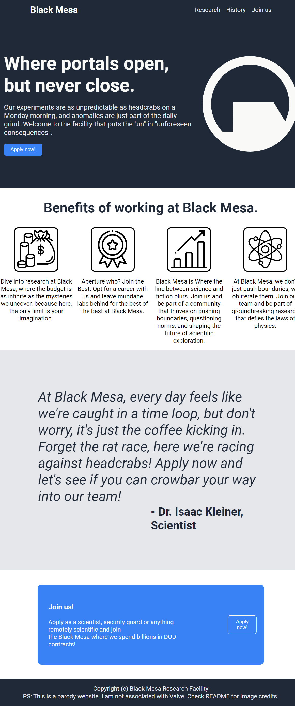

# Dummy Black Mesa Landing Page

## Live demo [HERE](https://blackmesa.jarvis09.com) (personal website)
**Or [here](https://jarvis09-yann.github.io/black-mesa-landing-page/) (hosted on Github pages)

A dummy landing page created while folowing the Odin Project foundations course.
More info on the [Odin project](https://www.theodinproject.com/lessons/foundations-landing-page)

**_Preview of the page & model at the end of the README_**

## Credits:

Valve Corporation (cant count up to 3) for the Black Mesa logo and the Half life IP.

### Flaticon:

[Money bag icon](https://www.flaticon.com/free-icon/money-bag_2953363?term=money&page=1&position=1&origin=search&related_id=2953363#)

[Medal icon](https://www.flaticon.com/free-icon/medal_4692414?term=best&page=1&position=3&origin=search&related_id=4692414)

[Chart icon](https://www.flaticon.com/free-icon/bar-chart_478544?term=chart&page=1&position=1&origin=search&related_id=478544)

[Atom icon](https://www.flaticon.com/free-icon/science_707557?term=science&page=1&position=54&origin=search&related_id=707557)

## NOTE:

DOD means Department Of Defense more info on [Wikipedia](https://en.wikipedia.org/wiki/United_States_Department_of_Defense).

English not being my first language there may be some english mistakes. If you find any, feel free to make a pull request.

Ideas of future improvements: adding a form and a backend where users could send (fake) applications to work at Black Mesa (probably will be when i'll learn backend dev.)

Parts of the text have been AI generated (i guess it's still better than just Lorem Ipsum)

Thank you for checking out my silly website.

